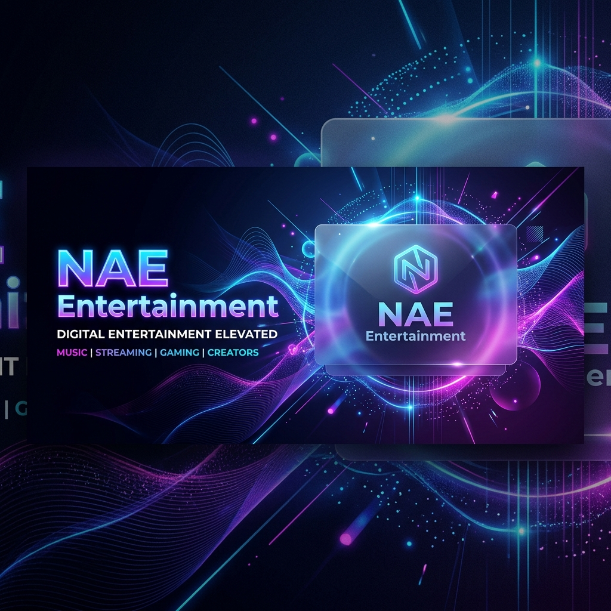

# NAE Entertainment - Frontend



## 🎨 Overview
The frontend of NAE Entertainment is a high-performance, responsive React application built with **Vite** and **Tailwind CSS**. It serves as the primary interface for users to interact with music and video content.

## 🚀 Key Features
- **Modern UI**: Crafted with Tailwind CSS and Radix UI components.
- **Micro-animations**: Smooth interactions using `AOS` and CSS transitions.
- **Localization**: Multi-language support (English/Indonesian) via `react-i18next`.
- **Dynamic Routing**: Seamless navigation using `react-router-dom`.

## 🛠️ Tech Stack
- **Framework**: React 18+
- **Build Tool**: Vite
- **Styling**: Tailwind CSS 4.0
- **Icons**: Lucide React
- **HTTP Client**: Axios

## 🚦 Getting Started

### Prerequisites
- Node.js (v18+)
- npm or yarn

### Installation
1. Install dependencies:
   ```bash
   npm install
   ```
2. Configure `.env.local` (Copy from `.env.example`):
   ```bash
   cp .env.example .env.local
   ```
3. Start the development server:
   ```bash
   npm run dev
   ```

## 🏗️ Build for Production
To generate a production-ready bundle:
```bash
npm run build
```
The output will be in the `dist/` directory.

---
Part of the [NAE Entertainment](..) project.
